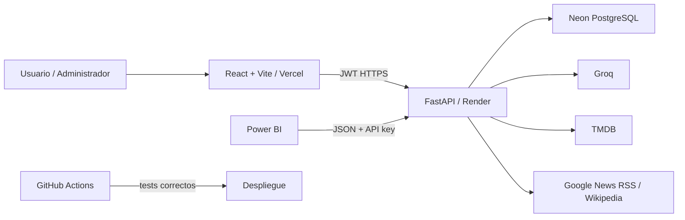

# Arquitectura CineIA

```mermaid
flowchart LR
 U[Usuario / Administrador] --> W[React + Vite / Vercel]
 W -->|JWT HTTPS| A[FastAPI / Render]
 A --> N[Neon PostgreSQL]
 A --> G[Groq]
 A --> T[TMDB]
 A --> R[Google News RSS / Wikipedia]
 P[Power BI] -->|JSON + API key| A
 C[GitHub Actions] -->|tests correctos| D[Despliegue]
```

El API valida JWT, rol, estado del servicio y saldo de cuota antes de cualquier llamada de IA. El endpoint de BI entrega únicamente datos agregados.
